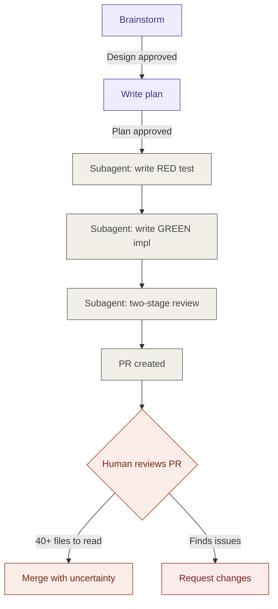
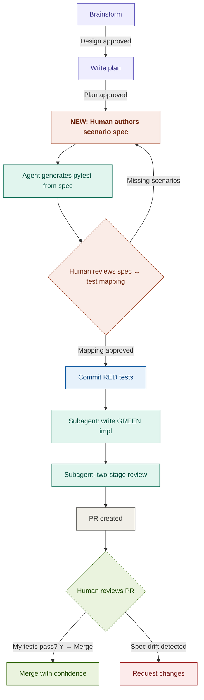
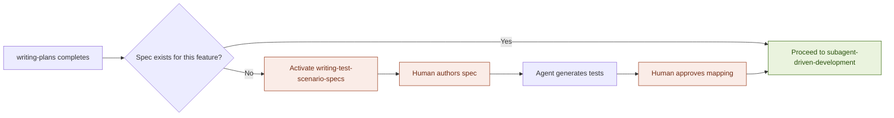

# PRD — Scenario-Driven Test Authoring Skill

| Field          | Value                                              |
| -------------- | -------------------------------------------------- |
| Feature        | `writing-test-scenario-specs` superpowers skill     |
| Author         | doc_pk                                             |
| Status         | Draft                                              |
| Version        | 1.0                                                |
| Date           | 2026-03-28                                         |
| Repository     | Personal superpowers skills directory              |
| Consumers      | `autobots-devtools-shared-lib`, `autobots-agents-mer`, `autobots-agents-pay` |

---

# 1. Background & Motivation

## 1.1 Context

Dynagent is a Python framework for enterprise agentic workflows. Development
velocity has increased significantly with the adoption of
[superpowers](https://github.com/obra/superpowers) — specifically the
`brainstorming` and `subagent-driven-development` skills in Claude Code.

The framework underpins two production applications (MER and PAY). Framework
features land in `autobots-devtools-shared-lib` first, with Jarvis as the
test harness, before being consumed downstream.

## 1.2 Problem statement

Code quality is high — nothing has broken production. However, when large PRs
land (e.g. [PR #39](https://github.com/Pratishthan/autobots-devtools-shared-lib/pull/39)),
there is **no systematic way to verify that the feature meets the original
requirement**. The confidence gap is not about correctness of code — it is
about **alignment of code to intent**.

### Three pain points in large PR review

| Pain point            | Description                                                                 |
| --------------------- | --------------------------------------------------------------------------- |
| **Volume**            | 40+ files changed — too many to hold the full picture in your head          |
| **Tracing intent**    | No direct line from the PR back to the original requirement/design decision |
| **Verifying correctness** | No way to confirm the code does the right thing without running every path mentally |

### Scope of concern

**Framework-level features** in the shared lib — guardrails, retry with
circuit breaker, eval runner, tool authorization, agent metrics. These are
the highest-leverage components where a gap between design and implementation
would hurt MER and PAY downstream.

## 1.3 Root cause analysis

The root cause is **where test authoring happens** in the current workflow.

In the superpowers workflow, the subagent owns test authoring. It writes
both the failing test (RED) and the implementation (GREEN). The human
steers the design and approves the plan, but **never touches the acceptance
criteria**.

This means PR review is the first time the human sees the tests. By then,
the implementation is already shaped around tests the human didn't write.
Reviewing 40 files post-hoc is the symptom — the disease is that the
acceptance criteria were never authored by the human.

## 1.4 Insight

doc_pk already authors acceptance criteria for MER features using the LLD
Section 11 format — structured scenario tables with Scenario Name, Steps,
Expected Result. This is a natural, domain-level format that maps 1:1 to
test functions.

**If this same format becomes the input to the TDD cycle, the human
controls acceptance criteria without writing test code.**

---

# 2. Current Workflow

## 2.1 Flow diagram



## 2.2 Ownership map (current)

| Phase                  | Owner   | Artifact                | Human reviews? |
| ---------------------- | ------- | ----------------------- | -------------- |
| Brainstorm             | Human   | Design doc              | Authors it     |
| Write plan             | Agent   | Implementation plan     | Approves it    |
| Write RED test         | Agent   | pytest code             | **No**         |
| Write GREEN impl       | Agent   | Implementation code     | **No**         |
| Two-stage review       | Agent   | Review comments         | **No**         |
| PR review              | Human   | 40+ file diff           | Too late       |

**The gap:** Human control drops to zero between plan approval and PR review.
Tests are the most important artifact (they define "done"), yet the human
never touches them.

---

# 3. Proposed Workflow

## 3.1 Flow diagram



## 3.2 Ownership map (proposed)

| Phase                  | Owner   | Artifact                    | Human reviews?       |
| ---------------------- | ------- | --------------------------- | -------------------- |
| Brainstorm             | Human   | Design doc                  | Authors it           |
| Write plan             | Agent   | Implementation plan         | Approves it          |
| **Author scenario spec** | **Human** | **Scenario tables (md)**  | **Authors it**       |
| Generate pytest        | Agent   | pytest code from spec       | Reviews mapping      |
| Commit RED tests       | Both    | Spec + tests in one commit  | Approves commit      |
| Write GREEN impl       | Agent   | Implementation code         | Not needed           |
| Two-stage review       | Agent   | Review comments             | Not needed           |
| PR review              | Human   | GREEN status + diff check   | **Trivial (< 5 min)** |

**The fix:** Human authors acceptance criteria in a format they already
know. Agent translates mechanically. PR review collapses to a pass/fail
check.

---

# 4. Requirements

## 4.1 Functional requirements

### FR-1: Hard gate enforcement

The skill MUST prevent invocation of `subagent-driven-development` or any
implementation skill until the scenario spec is authored and approved.

**Acceptance:** If a user says "skip the spec" or "just implement", the
agent refuses and re-presents the template.

### FR-2: Scenario spec template

The skill MUST present a reusable template in the LLD Section 11 format
with the following sections:

| Section | Purpose                                          |
| ------- | ------------------------------------------------ |
| 1.0     | Test data — named fixtures and sample data sets  |
| 1.1     | Positive tests — happy paths                     |
| 1.2     | Negative tests — failure modes, error conditions |
| 1.3     | Edge cases — boundaries, concurrency, empty inputs |
| 1.4     | Sanity scenarios — E2E smoke tests               |

Each row in 1.1–1.3 MUST contain: Scenario Name, Service/Unit, Priority,
Preconditions, Steps, Expected Result, Reference Models.

### FR-3: Spec-to-pytest translation

The skill MUST dispatch a subagent that mechanically translates each
scenario row into a pytest function, following these rules:

| Spec column       | Maps to                                          |
| ------------------ | ------------------------------------------------ |
| Scenario Name      | `test_` function name (lowercased, underscored)  |
| Service/Unit       | Module/class under test                          |
| Preconditions      | Fixtures or test setup                           |
| Steps              | Sequential calls in the test body                |
| Expected Result    | `assert` statements                              |
| Reference Models   | Imports and mock setup                           |
| Test data rows     | `@pytest.fixture` or `@pytest.mark.parametrize`  |

**Constraints:**
- The subagent MUST NOT invent scenarios beyond what the spec contains
- The subagent MUST NOT skip any scenario row
- Generated code MUST follow patterns from `dynagent_samples.py` and `CLAUDE.md`

### FR-4: Spec ↔ test mapping review

The skill MUST present the mapping between spec rows and generated test
functions for human approval. A reviewer subagent validates:

| Check                | Description                                          |
| -------------------- | ---------------------------------------------------- |
| Coverage             | Every scenario row has a matching test function       |
| Naming               | Test name derives from scenario name (traceable)      |
| Assertions           | Expected results from the spec appear as asserts      |
| No extras            | No test functions exist that don't trace to a spec row |
| Framework compliance | Tests follow `dynagent_samples.py` patterns           |

### FR-5: File locations and commit

| Artifact       | Location                                                          |
| -------------- | ----------------------------------------------------------------- |
| Scenario spec  | `docs/superpowers/specs/YYYY-MM-DD-<feature>-test-scenarios.md`   |
| Generated tests | `tests/` following existing project directory conventions         |

Both MUST be committed together in the same commit. The commit message
MUST reference the scenario spec as the source of truth.

### FR-6: Feedback loop

If the human identifies missing scenarios during the mapping review, the
flow MUST return to the spec authoring step — not proceed to implementation
with known gaps.

## 4.2 Non-functional requirements

| NFR   | Requirement                                                       |
| ----- | ----------------------------------------------------------------- |
| NFR-1 | Spec authoring should take < 15 minutes for a typical framework feature |
| NFR-2 | PR review after this workflow should take < 5 minutes             |
| NFR-3 | Skill MUST work within Claude Code's context window limits        |
| NFR-4 | Supporting files (prompts, template) loaded on-demand, not at session start |
| NFR-5 | Backward compatible — existing features without specs must not break |

---

# 5. Scenario Spec Format

## 5.1 Template structure

```markdown
# Test Scenario Spec — {Feature Name}

| Field       | Value                                |
| ----------- | ------------------------------------ |
| Feature     | {DYN-X}: {Feature title}             |
| Author      | doc_pk                               |
| Plan ref    | docs/superpowers/plans/{plan-file}   |
| Status      | Draft                                |

---

## 1.0 Test Data

| Data Set Name | Model / Entity | Purpose | Sample Data | Notes |
| ------------- | -------------- | ------- | ----------- | ----- |
|               |                |         |             |       |

## 1.1 Positive Tests

| Scenario Name | Service / Unit | Priority | Preconditions | Steps | Expected Result | Reference Models |
| ------------- | -------------- | -------- | ------------- | ----- | --------------- | ---------------- |
|               |                |          |               |       |                 |                  |

## 1.2 Negative Tests

| Scenario Name | Service / Unit | Priority | Preconditions | Steps | Expected Result | Reference Models |
| ------------- | -------------- | -------- | ------------- | ----- | --------------- | ---------------- |
|               |                |          |               |       |                 |                  |

## 1.3 Edge Cases

| Scenario Name | Service / Unit | Priority | Preconditions | Steps | Expected Result | Reference Models |
| ------------- | -------------- | -------- | ------------- | ----- | --------------- | ---------------- |
|               |                |          |               |       |                 |                  |

## 1.4 Sanity Scenarios

| Scenario Name | Steps | Assertions |
| ------------- | ----- | ---------- |
|               |       |            |
```

## 5.2 Example — Guardrails feature

A complete worked example was produced during the design conversation.
See `guardrails-test-scenario-spec.md` (7 positive, 6 negative, 4 edge
cases, 2 sanity scenarios). This serves as the reference implementation
of the format.

---

# 6. Skill Architecture

## 6.1 Directory structure

```
~/.claude/skills/writing-test-scenario-specs/
├── SKILL.md                          # Main skill definition
├── scenario-spec-template.md         # Reusable template (§5.1)
├── spec-to-pytest-prompt.md          # Subagent: translate spec → pytest
└── spec-reviewer-prompt.md           # Subagent: validate spec ↔ test mapping
```

## 6.2 Skill activation



## 6.3 SKILL.md frontmatter

```yaml
---
name: writing-test-scenario-specs
description: >
  Use after writing-plans produces an approved implementation plan
  and BEFORE subagent-driven-development begins. Guides the user
  through authoring a BDD-style test scenario spec that becomes
  the acceptance criteria for the feature.
---
```

## 6.4 Integration points

| Touch point                          | Change required                                                |
| ------------------------------------ | -------------------------------------------------------------- |
| `writing-plans` skill exit           | Add transition → invoke `writing-test-scenario-specs`          |
| `subagent-driven-development` entry  | Add precondition: scenario spec must exist (safety net)        |
| `test-driven-development` skill      | No change — subagent still does RED/GREEN, but RED comes from spec |

---

# 7. Anti-Patterns and Red Flags

These are rationalizations the agent will attempt. The skill MUST counter
each one explicitly.

| Rationalization                              | Counter                                                     |
| -------------------------------------------- | ----------------------------------------------------------- |
| "The plan already covers testing"            | Plan covers tasks. Spec covers acceptance. They are different. |
| "This is too simple to need a spec"          | Simple features drift silently. Especially then.             |
| Agent writes test code before spec is authored | Delete it. Start over with the template.                    |
| Agent invents scenarios not in the spec      | Remove them. Only spec rows become tests.                    |
| "I'll write the spec after implementation"   | Spec-after is a post-hoc justification, not acceptance criteria. |
| "The tests I wrote cover the same scenarios" | If they weren't authored by the human, they don't count.     |

---

# 8. Success Criteria

| Metric                                | Target                           |
| ------------------------------------- | -------------------------------- |
| Time to author scenario spec          | < 15 minutes per feature         |
| PR review time after adoption         | < 5 minutes per PR               |
| Test traceability                     | 100% of tests trace to a spec row |
| Spec drift                            | 0 test functions without a spec row |
| Backward compatibility                | Existing features unaffected      |
| Hard gate compliance                  | 0 implementations started without spec |

---

# 9. Implementation Plan Summary

| Step | What                                        | Effort  |
| ---- | ------------------------------------------- | ------- |
| 1    | Scaffold skill directory                    | 5 min   |
| 2    | Write SKILL.md with hard gate + flow        | 30 min  |
| 3    | Create scenario spec template               | 10 min  |
| 4    | Write spec-to-pytest subagent prompt        | 20 min  |
| 5    | Write spec reviewer subagent prompt         | 15 min  |
| 6    | Pressure-test skill with subagents (TDD)    | 30 min  |
| 7    | Wire into writing-plans / subagent-driven-dev | 10 min |
| 8    | First real use on guardrails feature        | 30 min  |
|      | **Total**                                   | **~2.5 hr** |

Full step-by-step details in `plan-of-action-test-scenario-skill.md`.

---

# 10. Artifacts Produced During Design

| File                                       | Purpose                                       |
| ------------------------------------------ | --------------------------------------------- |
| `guardrails-test-scenario-spec.md`          | Worked example — guardrails feature spec       |
| `plan-of-action-test-scenario-skill.md`     | Step-by-step implementation plan               |
| This file (`prd-scenario-driven-testing.md`) | PRD with full context, flows, and requirements |

---

# 11. Revision History

| Version | Date       | Author | Changes       |
| ------- | ---------- | ------ | ------------- |
| 1.0     | 2026-03-28 | doc_pk | Initial draft |
